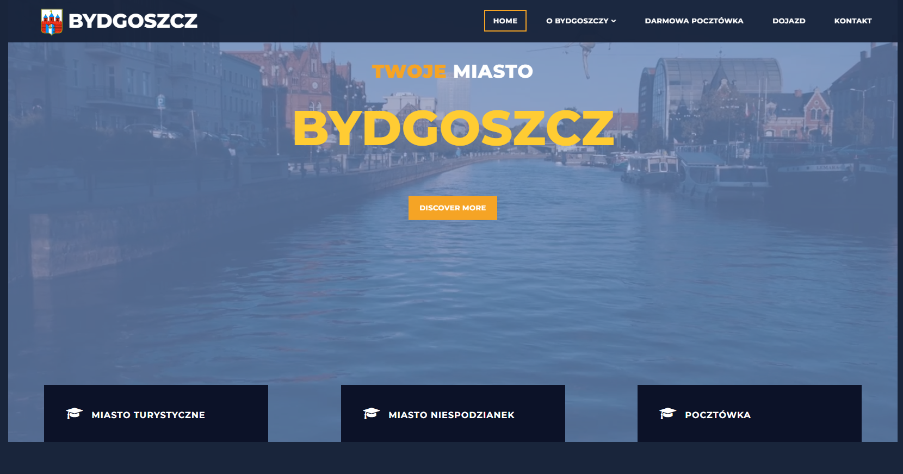
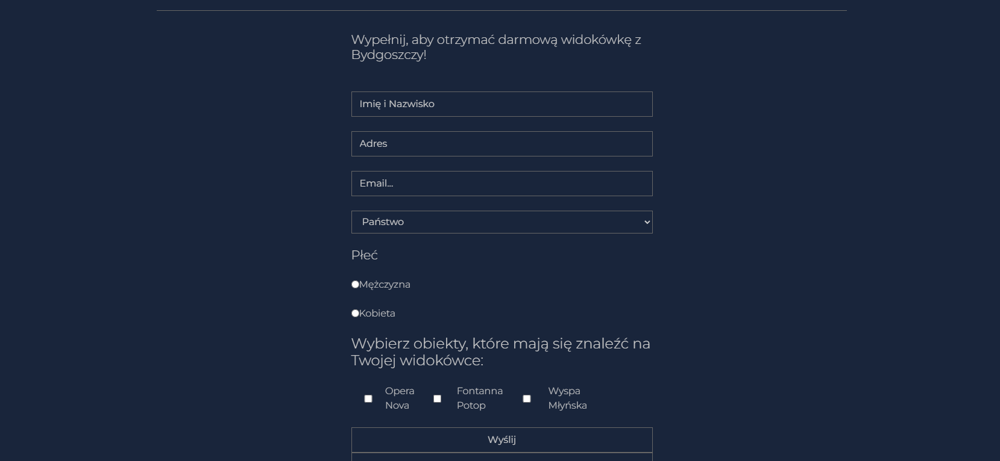

# BydgoszczCity  
**Academic Project**  
A comprehensive website about Bydgoszcz, Poland – featuring its history, attractions, culture, and travel tips.  

## Description  
This project consists of a static website based on `index.html`. It can be used for various purposes, such as presenting information, a portfolio, or a business website.  

## Project Preview  
- **Landing Page**  
    
- **Form**  
    

## Project Structure  
- `index.html` – The main HTML file containing the website structure.  
- `styles.css` – The CSS file for styling the website.  
- `script.js` – The JavaScript file for adding interactivity.  

## Requirements  
To run the website, simply use any web browser, such as:  
- Google Chrome  
- Mozilla Firefox  
- Microsoft Edge  

## How to Use?  
1. Download or clone this project.  
2. Open `index.html` in any web browser.  

## Customization  
To customize the website, edit the `index.html` file, as well as `styles.css` and `script.js`.  

## Author  
Jan Kowalski (KoowalDev)  

## License  
This project can be shared and modified under the chosen license (e.g., MIT, GPL, etc.).  
