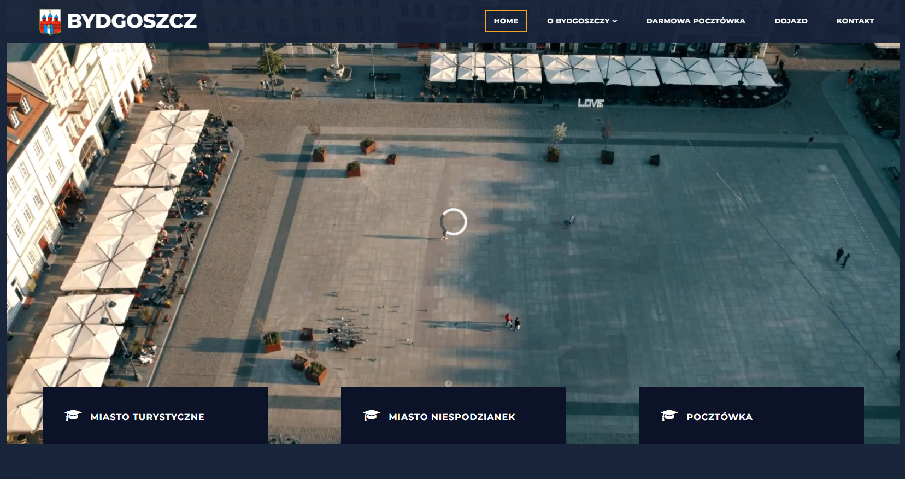

# Bydgoszcz Website Project



## Overview
This is a tourism website for the city of Bydgoszcz, Poland. The website showcases the city's attractions, interesting facts, and provides interactive features for visitors including a contact form and a postcard request form.

## Features
- Responsive design that works on multiple devices
- Navigation menu with smooth scrolling to sections
- Video background on the homepage
- Interactive elements that respond to user hover
- Location-based functionality with Google Maps integration
- Multiple information sections:
  - City attractions with images and descriptions
  - Interesting facts about Bydgoszcz
  - Free postcard request form
  - Contact form
  - Interactive map with directions

## Project Structure

### HTML (index.html)
The main structure of the website includes:
- Header with navigation menu
- Welcome section with video background
- Features section with interactive cards
- Places section showcasing city attractions
- Facts section with interesting information
- Postcard request form
- Map with directions functionality
- Contact form
- Footer with copyright information

### JavaScript (js/script.js)
Contains various functions for:
- Menu toggle functionality
- Content rotation effects
- Interactive hover effects
- Geolocation services for map routing
- Form data handling and storage
- Smooth scrolling between sections
- Active section tracking

### Other Resources
- **CSS files**: style.css, bootstrap.min.css, fontawesome.css
- **Images**: Attraction photos and city imagery
- **Video**: Background video showcasing the city

## Setup Instructions

1. **Clone or download the repository**

2. **API Key Setup**:
   - You need to replace "XXX" in the Google Maps API script with your actual Google Maps API key:
   ```html
   <script src="https://maps.googleapis.com/maps/api/js?key=YOUR_API_KEY&callback=initMap" async defer></script>
   ```

3. **Run the website**:
   - Open index.html in a web browser
   - For proper functionality, use a live server as some features require HTTP(S) protocol

## Browser Compatibility
The website works best in modern browsers:
- Google Chrome
- Mozilla Firefox
- Microsoft Edge
- Safari

## Features in Detail

### Interactive Map
- Uses Google Maps API to display a route from the user's current location to Bydgoszcz
- Requires geolocation permission from the user

### Postcard Request System
- Collects user information and preferences
- Stores user preferences using localStorage
- Allows users to select which attractions they want on their postcard

### Contact Form
- Temporarily stores form data in sessionStorage
- Configured to submit to an email address

## Notes for Developers
- The website uses jQuery for DOM manipulation and animations
- Bootstrap is used for responsive layout
- FontAwesome is used for icons
- The JavaScript contains multiple event handlers and custom jQuery plugins
- Local storage is used to save user preferences
- Session storage is used for contact form data

## License Information
The website uses the Timeless template, with copyright information in the footer.